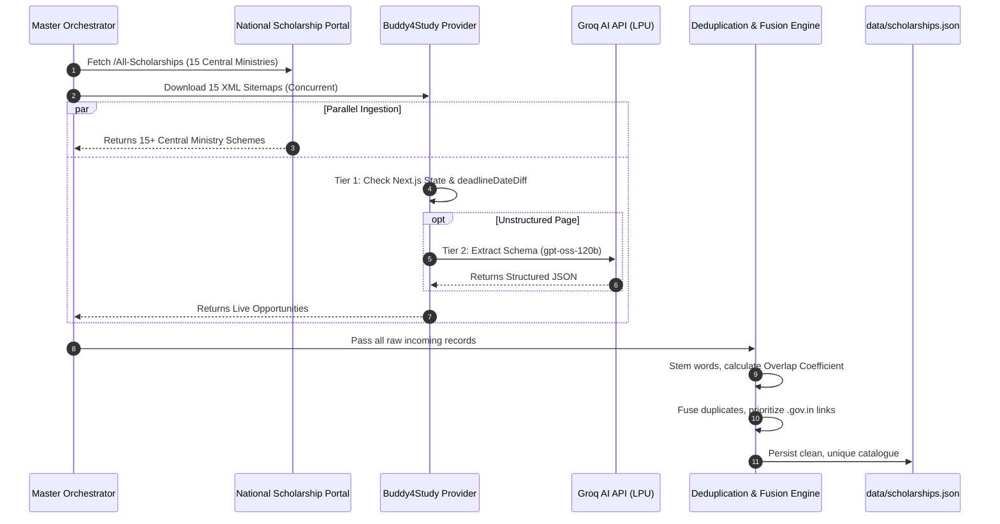
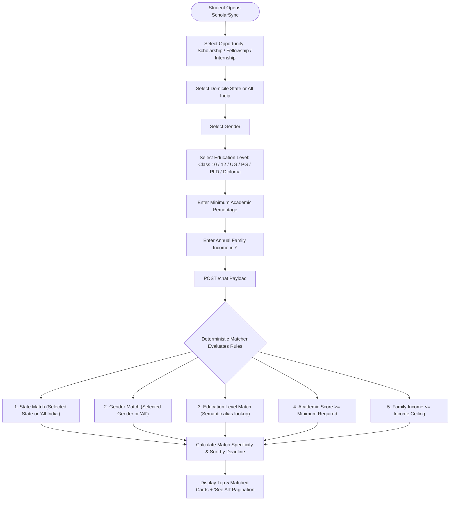

# 🎓 ScholarSync

> **AI-Powered, Multi-Source Scholarship Matching & Discovery Platform for Indian Students**

[](https://github.com/nihal1087/ScholarSync/actions/workflows/weekly-scraper.yml)
[](https://nodejs.org/)
[](https://expressjs.com/)
[](https://groq.com/)
[](LICENSE)

---

## 📌 Table of Contents

1. [About The Project](#-about-the-project)
2. [Key Features](#-key-features)
3. [System Architecture](#-system-architecture)
4. [How It Works (Step-by-Step Flowcharts)](#-how-it-works-step-by-step-flowcharts)
   - [1. Multi-Source Ingestion & Fusion Pipeline](#1-multi-source-ingestion--fusion-pipeline)
   - [2. User Chat & Deterministic Matching Flow](#2-user-chat--deterministic-matching-flow)
5. [Deduplication & Record Fusion Engine](#-deduplication--record-fusion-engine)
6. [Project Structure](#-project-structure)
7. [Getting Started Locally](#-getting-started-locally)
   - [Prerequisites](#prerequisites)
   - [Installation & Setup](#installation--setup)
   - [Environment Variables](#environment-variables)
8. [Running the Scraper Pipeline](#-running-the-scraper-pipeline)
9. [API Reference](#-api-reference)
10. [Automated CI/CD Workflows](#-automated-cicd-workflows)
11. [Contributing & License](#-contributing--license)

---

## 🌟 About The Project

Scholarships in India are scattered across dozens of government portals ([scholarships.gov.in](https://scholarships.gov.in/), State DTE portals, UGC/AICTE) and corporate CSR foundations. Sifting through hundreds of PDFs, complex guidelines, and expired listing pages is overwhelming for students.

**ScholarSync** solves this by providing:
- An **interactive, conversational chatbot** that asks just 6 simple questions (opportunity type, domicile state, gender, education level, score %, and annual family income).
- An **Express.js deterministic matching engine** that calculates precise eligibility scores in `< 50ms`.
- A **multi-source ingestion pipeline** combining live central government schemes from the **National Scholarship Portal (NSP)**, sitemaps from **Buddy4Study**, and curated evergreen government seed schemes.
- **Cross-source deduplication and record fusion** that eliminates redundant listings, prioritizes official `.gov.in` application links, and ensures students receive 100% active, verified opportunities.

---

## ✨ Key Features

- 🏛️ **Multi-Source Ingestion**: Aggregates opportunities in parallel from the official **National Scholarship Portal (NSP)** and top private educational foundations.
- ⚡ **3-Tier High-Speed Extraction**:
  1. **Tier 1 (Sub-millisecond Next.js State Deserialization)**: Ingests structured JSON directly from SSR payloads in `< 1ms`.
  2. **Tier 2 (Groq AI Inference)**: Uses `openai/gpt-oss-120b` running on Groq LPUs for rapid structured JSON extraction.
  3. **Tier 3 (Local Heuristic Fallback)**: Robust regex and markdown parser for maximum fault tolerance.
- 🛡️ **Failsafe Circuit Breaker**: If any live website is temporarily unreachable, isolated error boundaries (`Promise.allSettled()`) and curated seed fallbacks guarantee that the application **never breaks**.
- 🔍 **Stemmed Token Deduplication**: Matches schemes across sources using Overlap Coefficient similarity ($\ge 75\%$), eliminating duplicate cards while retaining the richest eligibility criteria and official `.gov.in` links.
- 💬 **Zero-Dependency Responsive UI**: Lightweight vanilla JavaScript, modern glassmorphic CSS, and responsive design with zero client-side frameworks or heavy build steps.
- 🔄 **Automated Weekly Refresh**: Scheduled GitHub Actions workflows automatically crawl, deduplicate, and commit updated catalogues every week.

---

## 🏗️ System Architecture

```mermaid
flowchart TD
    subgraph Client ["Client (Browser)"]
        UI["Chat Interface (public/index.html & script.js)"]
    end

    subgraph Server ["Express.js Backend (server.js)"]
        Routes["API Route (/chat)"]
        Validator["Input Validation Middleware"]
        Matcher["Matching Engine (src/services/matching.js)"]
        TextUtil["Text Normalization & Deduplication (src/utils/text.js)"]
    end

    subgraph DataStorage ["Data Layer"]
        DB[("Live Catalogue (data/scholarships.json)")]
        SeedDB[("Evergreen Seed Backup (data/seed_scholarships.json)")]
    end

    subgraph Ingestion ["Multi-Provider Ingestion Engine (scraper/_01_scraper.js)"]
        Orchestrator["Orchestrator (Promise.allSettled)"]
        P1["NSP Provider (scholarships.gov.in)"]
        P2["Buddy4Study Provider (Sitemaps + Groq AI)"]
        P3["Evergreen Seed Provider"]
        Dedup["Stemmed Token Deduplication & Fusion"]
    end

    subgraph CI ["Automated CI/CD"]
        Cron["GitHub Actions Weekly Scraper Workflow"]
    end

    UI <-->|POST /chat (JSON)| Routes
    Routes --> Validator --> Matcher
    Matcher --> TextUtil
    DB -.->|Loaded at Startup| Matcher
    SeedDB -.->|Circuit Breaker Fallback| Matcher

    Cron -->|Triggers Weekly| Orchestrator
    Orchestrator --> P1 & P2 & P3
    P1 & P2 & P3 --> Dedup
    Dedup -->|Writes Clean Records| DB
```

---

## 🔄 How It Works (Step-by-Step Flowcharts)

### 1. Multi-Source Ingestion & Fusion Pipeline



---

### 2. User Chat & Deterministic Matching Flow



---

## 🧬 Deduplication & Record Fusion Engine

When scraping across multiple sources, the exact same scheme is often titled differently:
- **Source A (NSP)**: *"AICTE Pragati Scholarship Scheme for Girl Students (Technical Degree/Diploma)"*
- **Source B (Buddy4Study)**: *"AICTE Pragati Scholarship for Girls 2026-27"*

A naive string match would produce redundant duplicate cards. ScholarSync implements an **Overlap Coefficient & Record Fusion Engine** ([src/utils/text.js](src/utils/text.js)):

1. **Morphological Stemming & Stopword Stripping**: Removes noise words (`"scheme"`, `"program"`, `"2026-27"`, `"portal"`, `"apply"`) and applies root word reduction (`"girls"` $\leftrightarrow$ `"girl"`).
2. **Overlap Coefficient Similarity**:
   $$\text{Overlap}(A, B) = \frac{|A \cap B|}{\min(|A|, |B|)}$$
   When $\text{Overlap} \ge 0.75$ and categories match, a duplicate is confirmed.
3. **Record Fusion**:
   - Keeps the official government application link (`.gov.in` / direct portal).
   - Unites education classes (e.g. `['UG']` + `['Diploma']` $\to$ `['UG', 'Diploma']`).
   - Retains the most detailed benefits description and strictest eligibility requirements.

---

## 📁 Project Structure

```text
ScholarSync/
├── .github/
│   └── workflows/
│       └── weekly-scraper.yml     # GitHub Actions cron workflow
├── data/
│   ├── scholarships.json          # Main ingested scholarship database
│   └── seed_scholarships.json     # Curated evergreen government backup
├── public/
│   ├── favicon.svg                # Scalable vector favicon
│   ├── favicon.jpg                # High-res raster favicon
│   ├── index.html                 # Chatbot frontend markup
│   ├── script.js                  # Frontend client logic & card rendering
│   └── style.css                  # Responsive UI styles & design tokens
├── scraper/
│   ├── providers/
│   │   ├── buddy4study.js         # Buddy4Study 3-tier live provider
│   │   ├── gov_schemes.js         # NSP (scholarships.gov.in) live provider
│   │   └── seed_provider.js       # Evergreen government seed provider
│   ├── _01_scraper.js             # Master multi-provider orchestrator
│   └── _01_scraper.py             # Python alternative scraper
├── src/
│   ├── config/
│   │   └── index.js               # Application configuration
│   ├── data/
│   │   └── scholarships.js        # In-memory database loader & fallback
│   ├── middleware/
│   │   ├── errorHandler.js        # Global error middleware
│   │   └── validateChat.js        # Chat request validation
│   ├── routes/
│   │   └── chat.js                # POST /chat route controller
│   ├── services/
│   │   └── matching.js            # Profile filtering, ranking & pagination
│   └── utils/
│       └── text.js                # Text normalization, stemming & deduplication
├── .env.example                   # Template environment variables
├── package.json                   # Project metadata & npm dependencies
├── server.js                      # Express application entrypoint
└── README.md                      # Comprehensive project documentation
```

---

## 🚀 Getting Started Locally

### Prerequisites

- **Node.js**: `v20.0.0` or newer recommended.
- **npm**: `v9.0.0` or newer.

### Installation & Setup

1. **Clone the repository**:
   ```bash
   git clone https://github.com/nihal1087/ScholarSync.git
   cd ScholarSync
   ```

2. **Install dependencies**:
   ```bash
   npm install
   ```

3. **Configure Environment Variables**:
   Create a `.env` file in the root directory (or copy from `.env.example`):
   ```bash
   cp .env.example .env
   ```

4. **Start the local server**:
   ```bash
   npm start
   ```
   Open your browser at **[http://localhost:4002](http://localhost:4002)**.

---

## ⚙️ Environment Variables

| Variable | Required | Default | Description |
|---|---|---|---|
| `PORT` | No | `4002` | Local server port |
| `GROQ_API_KEY` | For Scraper | — | Groq API key for LPU-accelerated AI extraction |
| `GROQ_MODEL` | No | `openai/gpt-oss-120b` | Model used for structured JSON extraction |
| `SCRAPE_LIMIT` | No | `500` | Target number of opportunities to discover per scrape |
| `SCRAPER_CONCURRENCY` | No | `10` | Number of simultaneous concurrent page fetches |

> **Note**: The web application works out of the box using the checked-in `data/scholarships.json`. API credentials are only required when running the scraper to refresh the catalogue.

---

## 🕷️ Running the Scraper Pipeline

To refresh the scholarship catalogue from live portals:

```bash
npm run scrape
```

### What Happens During a Scrape:
1. **National Scholarship Portal (NSP)**: Connects to `https://scholarships.gov.in/All-Scholarships` and extracts all active Central Ministry schemes.
2. **Buddy4Study**: Downloads XML sitemaps in parallel, filters for live deadlines (`deadlineDateDiff >= 0`), and ingests opportunities with 10x concurrency.
3. **Smart Fusion**: Fuses records from all providers, strips duplicates, and saves the verified dataset to `data/scholarships.json`.

---

## 📡 API Reference

### Match Scholarships

```http
POST /chat
Content-Type: application/json
```

#### Request Body
```json
{
  "category": "Scholarship",
  "state": "Maharashtra",
  "gender": "Female",
  "education": "UG",
  "percentage": 80,
  "income": 500000,
  "offset": 0,
  "limit": 5,
  "showAll": false
}
```

#### Response Body
```json
{
  "reply": "Found <strong>8</strong> opportunities matching your profile.",
  "total": 8,
  "offset": 0,
  "limit": 5,
  "nextOffset": 5,
  "hasMore": true,
  "results": [
    {
      "scholarship_name": "AICTE Pragati Scholarship for Girls",
      "category": "Scholarship",
      "tags": {
        "state": "All India",
        "gender": "Female",
        "class": ["UG", "Diploma"]
      },
      "requirements": {
        "min_percentage": 60,
        "max_family_income": 800000
      },
      "scholarship_amount": "₹50,000 per annum",
      "application_deadline": "31-Oct-2026",
      "provider": "All India Council for Technical Education (AICTE)",
      "region": "India",
      "summary": "Financial support for meritorious girl students admitted to technical degree or diploma courses.",
      "eligibility": "Girl students admitted in 1st year of degree/diploma in AICTE-approved institutions with family income <= ₹8 Lakh.",
      "benefits": "₹50,000 per year for tuition fee and laptop/book expenses.",
      "key_points": [
        "Maximum 2 girls per family eligible",
        "Disbursed directly via DBT into student's Aadhaar-seeded bank account"
      ],
      "apply_link": "https://scholarships.gov.in/",
      "url": "https://scholarships.gov.in/All-Scholarships"
    }
  ]
}
```

---

## 🤖 Automated CI/CD Workflows

The repository includes a production-ready GitHub Actions workflow ([.github/workflows/weekly-scraper.yml](.github/workflows/weekly-scraper.yml)):

- **Trigger Schedule**: Runs automatically every Monday at `00:00 UTC` (`05:30 IST`), or manually via `workflow_dispatch`.
- **Pipeline Execution**:
  1. Sets up Node.js 20 environment.
  2. Runs `npm run scrape` using repository secrets (`GROQ_API_KEY`).
  3. Checks git diff and commits updated `data/scholarships.json` automatically.

---

## 🤝 Contributing

Contributions, issues, and feature requests are welcome!
1. Fork the repository.
2. Create your feature branch (`git checkout -b feature/AmazingFeature`).
3. Commit your changes (`git commit -m 'Add AmazingFeature'`).
4. Push to the branch (`git push origin feature/AmazingFeature`).
5. Open a Pull Request.

---

## 📜 License

Distributed under the **MIT License**. See `LICENSE` for details.
